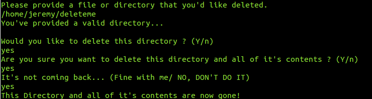

# UtilityProgram
### File deletion program written in Python.

* Purge Files: is a program that purges an entire directory or file given user input. The user is prompted 3 times before deleting something so that it is hard to accidentally delete something. 

#### USING THE PROGRAM (Disclaimer I have only used and tested this on Linux Ubuntu 14.04 and Linux Ubuntu 16.04)
##### Step 1 - Download the purge program from https://github.com/MorrisLaw/UtilityPrograms via the "clone or download" link.
##### Step 2 - cd to the path where you've installed the program, then navigate to purge.py.
  * Be sure to have unzipped your package first, before navigating to the script.
  * This is the python script that will be run. It is located under the PurgeFiles directory in the package.
  
##### Step 3 - While in terminal, run the command 'python3 purge.py' to start the script. 
  * This uses the python 3 interpreter, so make sure you have python 3 installed. You can get it from https://www.python.org/downloads/.
  

#### USE CASES purge.py
#### There are a lot of inputs that this program allows at certain stages of the deletion process. At the beginning and throughout most of the script, you can continue by responding either yes(y, Y, yes, Yes) or any other keyboard input that's not those responses, to cancel. At the last step if hitting yes all the way through, it will ask you one last time if you want to delete the file or directory. At this point you can still respond with the normal yes or no OR you can respond with Fine with me (for yes) or as stated before, any other keyboard input that's not those responses, to cancel.

##### Successful deletion of directory will look similar to this exchange of input and output, in the terminal.

##### Successful deletion of a file will look similar to this exchange of input and ouput, in the terminal.

##### Successful cancelling of a deletion will output a message similar to this (will say directory instead of file if cancelling the deletion of a directory.)

##### This is what happens when an invalid path is given.

#### SCREENSHOT OF DEMO --> purge.py on Linux Ubuntu 14.04

#### OVERALL DESIGN OF PROGRAM

